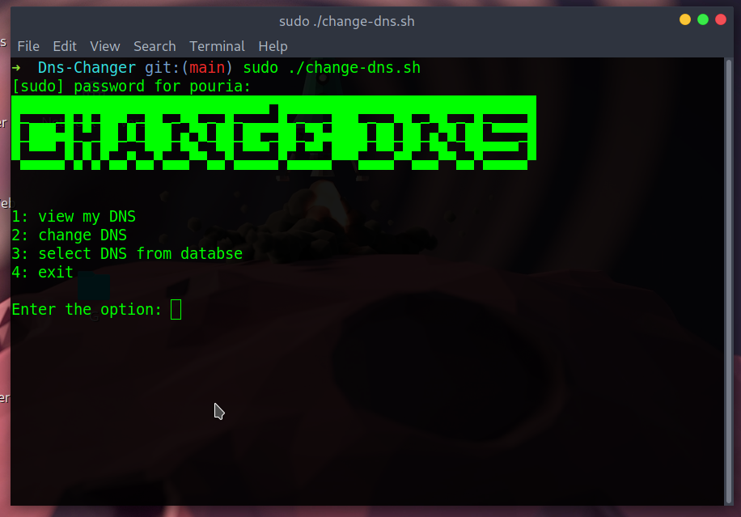
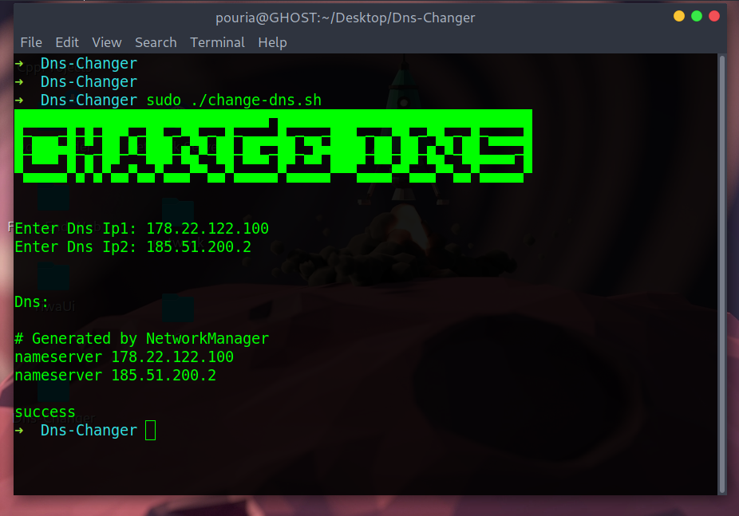

# Dns-Changer
A tool written in Bash script for changing DNS on Linux

Just run the program with **root access** and easily experience the DNS change operation and pay attention that it will give you an error if you enter the DNS structure incorrectly.

#### Features of this tool :smiley:

:zap:Set DNS manually 

:zap:Setting DNS based on the list of famous DNS databases such as shecan, Google, etc 

:zap:View DNS set 

